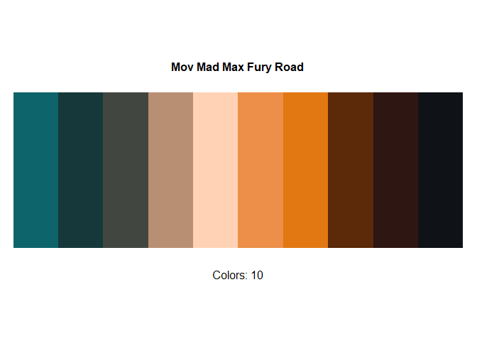
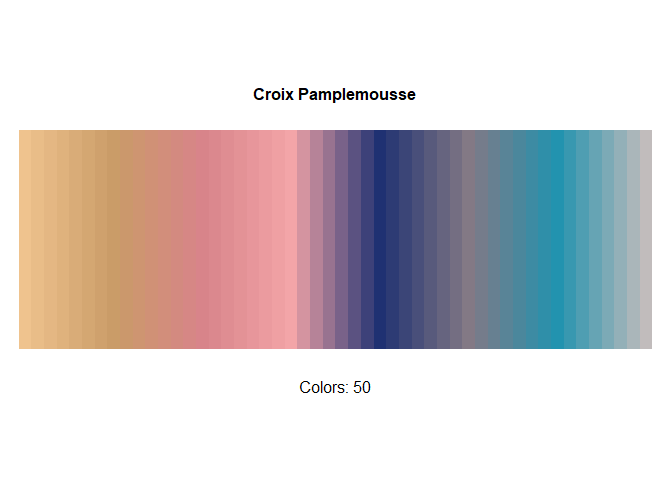

# croix 

[](https://travis-ci.org/btmonier/croix)
[](https://www.tidyverse.org/lifecycle/#experimental)

## Overview

This R package serves as a color palette generator for color schemes to
be used in plotting data. The original set of colors schemes for this
package was based on the colors found on LaCroix cans. Later, color
schemes from other popular media were also used (e.g. other beverages,
movies, etc. ). I hope you find the colors pleasing to the eye. Thanks\!

## Installation

The current way to install this package is only through GitHub:

``` r
if (!require("devtools")) install.packages("devtools")
devtools::install_github("btmonier/croix")
```

## Usage

To get a list of palettes available through this package, use the
following parameter:

``` r
names(croix::croix_palettes)
#>  [1] "croix_pure"                        
#>  [2] "croix_berry"                       
#>  [3] "croix_cran_raspberry"              
#>  [4] "croix_lemon"                       
#>  [5] "croix_lime"                        
#>  [6] "croix_orange"                      
#>  [7] "croix_pamplemousse"                
#>  [8] "croix_peach_pear"                  
#>  [9] "croix_coconut"                     
#> [10] "croix_apricot"                     
#> [11] "croix_passionfruit"                
#> [12] "croix_key_lime"                    
#> [13] "croix_mango"                       
#> [14] "croix_tangerine"                   
#> [15] "mov_the_shining"                   
#> [16] "mov_the_big_lebowski"              
#> [17] "mov_star_wars_ep_v"                
#> [18] "mov_the_godfather"                 
#> [19] "mov_the_revenant"                  
#> [20] "mov_fargo"                         
#> [21] "mov_the_professional"              
#> [22] "mov_akira"                         
#> [23] "mov_pulp_fiction"                  
#> [24] "mov_taxi_driver"                   
#> [25] "mov_a_clockwork_orange"            
#> [26] "mov_ferris_buellers_day_off"       
#> [27] "mov_fear_and_loathing_in_las_vegas"
#> [28] "mov_american_beauty"               
#> [29] "mov_blade_runner"                  
#> [30] "mov_alien"                         
#> [31] "mov_napoleon_dynamite"             
#> [32] "mov_edward_scissorhands"           
#> [33] "mov_thelma_and_louise"             
#> [34] "mov_fight_club"                    
#> [35] "mov_the_truman_show"               
#> [36] "mov_mad_max_fury_road"             
#> [37] "mov_resevoir_dogs"                 
#> [38] "mov_blue_velvet"                   
#> [39] "mov_silence_of_the_lambs"          
#> [40] "mov_the_matrix"                    
#> [41] "mov_arrow_video"                   
#> [42] "mov_aladdin"                       
#> [43] "mov_alice"                         
#> [44] "mov_american_psycho"               
#> [45] "mov_annie_hall"
```

You can get a vector of hex color codes, simply use the following:

``` r
crPal <- croix::croix_palette(name = "mov_mad_max_fury_road")
crPal
#>  [1] "#0D646B" "#16383A" "#414640" "#B88F73" "#FFD2B5" "#ED8F49" "#E27812"
#>  [8] "#5C2A09" "#2E1612" "#0F1217"
```

To visualize the color scheme, use:

``` r
crPal <- croix::croix_palette(name = "mov_mad_max_fury_road")
plot(crPal)
```

<!-- -->

To get a continuous gradient of a scheme, use:

``` r
    crPal <- croix::croix_palette(
        name = "croix_pamplemousse", 
        n = 50, 
        type = "continuous"
    )
    plot(crPal)
```

<!-- -->

To see all of the schemes at once, use:

``` r
croix::croix_all()
```

<!-- -->

-----

*Last updated:* 2019-02-08
